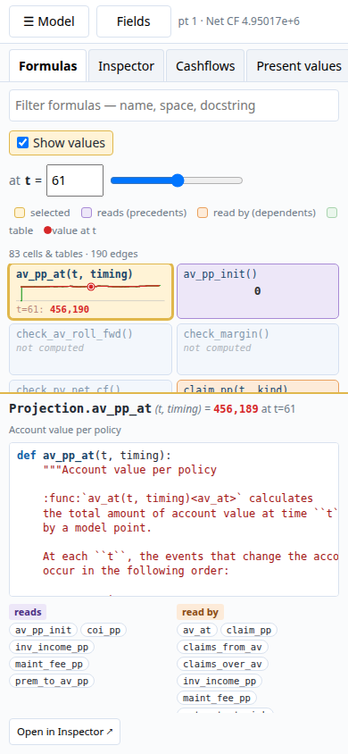

# lifelib Explorer

An **experimental** explorer for [lifelib](https://lifelib.io)'s Python
actuarial models — interactive and visual.

lifelib is a collection of free and open-source actuarial models started by
**[Fumito Hamamura](https://www.linkedin.com/in/fumito-hamamura/)**, built on
his [modelx](https://modelx.io) framework.

Here you can:

- Choose from a selection of models, or upload your own (many don't work yet,
  or aren't well suited)
- Interactively explore and manipulate model points, with cashflows
  recomputing as you drag
- Trace any cell's formula, value and precedents/dependents through modelx's
  graph, including the tables it reads
- Edit formulas and see the effects immediately, then download the modified
  model as a modelx zip (not an optimised workflow yet)


Fast feedback in modelling workflows — interpretation and communication as
much as for development — is a keen interest of mine.
[Actuarial Playground](https://actuarialplayground.com) gets its fast,
interactive feedback from being based on calculang compiled to
JavaScript<sup>\*</sup>. lifelib Explorer shows that, thanks to
[Pyodide](https://pyodide.org) and WebAssembly, we can get a similar
experience from Python actuarial models: Python runs in the browser, with no
server or backend complexity.

It works on mobile — and there is also a PyQt desktop application.

**How it was made.** This was also an experiment in process: the code was
largely written by LLMs, driven from a terminal session in
`tmux` — once on the web, a good part of it from my phone. It is **largely
vibe-coded**: I steered technical and design choices and checked the
behaviour, not much of the code, so **expect bugs**.

I continue to develop other modelling work and research through
[calculang](https://calculang.dev). In 2025 I presented some aspects around
this to the Society of Actuaries in Ireland, a presentation which is available
[on YouTube](https://www.youtube.com/watch?v=3C1mojRzfBA). That presentation included Actuarial Modeller - on which some design elements here are based & still a WIP - feedback welcome!

<sup>\*</sup> <sub>While calculang relies on JavaScript now, thanks to
WebAssembly future-calculang might not — and without sacrificing its core
aims.</sub>

**Warning** From here heavily LLM-generated and verbose content:


**The Formulas tab** (the landing view) lays out **every cell of the model as
a live card** — here `basiclife / BasicTerm_S`, 43 cells and tables, 85
edges. Each card is a sparkline over `t` from the last computation with the
value at the chosen `t` (`t = 60` above); scalars show their value large.
`pols_if` is selected: what it **reads** is violet (`policy_term`,
`pols_if_init`), what **reads it** is orange (`expenses`, `premiums`,
`pv_pols_if`), and cells that are both — the `t−1` recursion through
`pols_death`, `pols_lapse`, `pols_maturity` — are split diagonally. The
formula's source is on the right with clickable cell names, chip lists of
what it reads / what reads it, and a one-click jump to trace exactly
`pols_if(60)` in the Inspector. Drag a slider on the left and every card
updates.


The same view on `savings / CashValue_SE` — lifelib's generic savings model
(single-premium variable-annuity-style and level-premium variable-life
product types, monthly steps, investment returns driven by a table of
standard-normal draws): 83 cells and tables, 190 edges. `av_pp_at(t, timing)`
— the account value per policy — is selected; the jagged `inv_income`,
`inv_return_mth` and `coi_pp` sparklines are the stochastic return showing
through, and two-parameter cells (`(t, timing)`, `(t, kind)`) are cards like
any other. Cells the last computation never touched (`check_*`) say *not
computed*.

Alongside the Formulas tab sit the **Inspector** (below — search any cell,
see its formula, value chart and the exact nodes it consumed / that consumed
it), the chart tabs (Cashflows, Present values, Policy counts) and About. The
left panel holds the model chooser, model point chooser and the
auto-generated field editor with sliders; the same layout stacks on a
[phone](#web-build-pyodide--webassembly).


> **The lifelib models are not modified.** The `lifelib/` tree is a git
> submodule — a pristine copy of lifelib as published (MIT, © its authors),
> pinned at an upstream release commit — no formula,
> input file or serialized model has been changed, and the explorer never
> writes into it. Everything the app does to a model (overriding a model
> point table, fixing a scenario parameter, reading cached nodes) happens
> **in memory on the loaded modelx model** and is discarded when it's
> unloaded. Formula edits made in the Inspector likewise change only the
> in-memory model; **Export model…** writes the result to a *new* zip you
> choose, never back into `lifelib/`. The web build re-packages the
> *unchanged* model directories into zips (`web/build_models.py` — copies
> files, edits nothing). Where the
> explorer shows a table a model doesn't itself define — the synthesized
> `result_cf`/`result_pv` for Past Libraries — that is computed by the
> explorer from the model's own per-period cells, not added to the model.

## Quick start

### Get the code

`lifelib/` is a **git submodule** pinned to an upstream commit
([lifelib-dev/lifelib](https://github.com/lifelib-dev/lifelib), `main`,
currently `7668467` = v0.17.1 + the `delib` merge) — clone with it:

```bash
git clone --recurse-submodules <this-repo>
# already cloned without it:
git submodule update --init
```

Without the submodule there are no models to load, and
`web/build_models.py` has nothing to package. To move to a newer lifelib:
`git submodule update --remote lifelib` (then re-run the tests and the web
build — the model list and `engine_core.UNSUPPORTED` may need updating).

### In the browser

The web build is a static site — any file host serves it, and the page then
needs nothing but itself (the Python runtime and all wheels are vendored).
To build and serve it locally:

```bash
uv sync
cd web && npm install && cd ..          # once: fetches the Pyodide runtime to vendor
uv run python web/build_models.py       # models + manifest + runtime -> web/dist/ (~39 MB)
cd web/dist && python -m http.server 8080
```

Open <http://localhost:8080>. First visit downloads ~50 MB of runtime (cached
afterwards) and boots Python in ~13 s; `BasicTerm_S` then loads in ~3.5 s and
recomputes in under 150 ms — slider-live. Details, measurements and the
crash-recovery story are in [Web build](#web-build-pyodide--webassembly).

### On the desktop

Requires Python ≥ 3.10 and [uv](https://docs.astral.sh/uv/).

```bash
uv sync
uv run lifelib-explorer            # uses ./lifelib/lifelib/libraries by default
uv run lifelib-explorer /path/to/models   # or point it elsewhere
```

### Then, in either

1. Choose a model from the picker (`basiclife / BasicTerm_S` is loaded for
   you at start) — it loads on selection; unsupported models are greyed out
   with the reason in their tooltip. **Load model…** is for a zip exported
   from the explorer (see [below](#editing-formulas-exporting-and-loading-models)).
2. Pick a model point in the drop-down (type to search).
3. Edit any field — numeric fields have **sliders** you can drag; on fast
   models the charts update live during the drag (throttled adaptively, see
   below), categorical fields are combo boxes.
4. **Reset fields** restores the original values for the selected point.

### Keyboard

| Shortcut | Action |
|---|---|
| `Ctrl+K` | focus the Inspector search |
| `↓` / `Enter` in search | move into results / open the selected cell |
| `Alt+←` / `Alt+→` | Inspector history back / forward |
| `Ctrl+R` | reset the point's fields |
| `Ctrl+Enter` / `Esc` in the formula editor | apply / cancel the edit |

### Model point data

Many models ship with only a handful of sample points (`CashValue_ME` has 4,
`Term_US_S` has 2). Three buttons under the point selector fix that:

- **Generate…** — append N synthetic points. Existing rows are bootstrapped
  (sampled with replacement) so cross-field constraints stay valid — e.g.
  `duration_mth ≤ policy_term × 12`, rate-table coverage — and only
  monetary-scale columns (floats, ints ≥ 1000 like `sum_assured`,
  `premium_pp`) are jittered ±15 %. Naive independent per-column sampling was
  tried first and rejected: it generates combinations the models' rate/scenario
  tables don't cover.
- **Import…** — load a table from **Parquet** (preferred: preserves exact
  dtypes and index), CSV, or Excel. Columns are validated and coerced to the
  loaded model's schema, so a round-trip can't corrupt dtypes.
- **Export…** — save the current table to Parquet/CSV (default location:
  `modelpoints/<model>/`, which is gitignored).

Why Parquet rather than more Excel? The bundled tables live in `.xlsx` inside
each model — fine as shipped inputs, but poor as a working store: Excel
round-trips mangle dtypes (ints→floats, strings/dates), is slow for 10k+ rows,
and diffs badly. Parquet keeps the exact pandas schema, loads in milliseconds,
and stays out of the model directories entirely (the store is a sidecar —
model folders are never modified).

Recommended models for interactive use: `BasicTerm_S` / `BasicTerm_SE`
(~0.05 s per recompute) and the `savings/CashValue_*` models (~1 s).
`BasicTerm_M` works but takes ~10 s per recompute (see below).

### The Inspector

The **Inspector** tab is a browser for the model's inner workings:

- **Search** (`Ctrl+K`): type to rank-search every cell in the model by name,
  space, docstring and formula source. Tokens are AND-ed; matches on the name
  outrank matches in the space, docstring, or source, and doc/source hits show
  the matching line as context. `Enter` opens the top hit.
- **Cell view**: signature, docstring, full formula source, and the list of
  **cached invocations** from the last computation (e.g. `pols_if` at
  `t = 0…120`). The first cached invocation is traced automatically, so the
  value and dependency graph appear immediately; pick another from the
  drop-down, or type args and press Enter to trace a specific invocation.
  Multi-parameter cells get **one discrete selector per parameter** — in a
  two-life pension model (`PA_UK_S`), `lives_if(k, life)` shows `[k ▾] [life ▾]`
  each listing that parameter's cached values, so you flip life 1 → 2 at the
  same `k` in one click (a combination that wasn't computed snaps to the
  nearest cached one). The value chart draws **one line per parameter
  combination** (`life=1` vs `life=2`) with the traced invocation marked on
  its own line.
- **Node view**: for a specific invocation (e.g. `pols_if(12)`) you see its
  computed value plus:
  - **Precedents** — the exact nodes its formula consumed, with values
    (`policy_term() = 10`, `pols_if(11) = 0.907388`, …);
  - **Dependents** — the nodes that consumed it (`pols_death(12)`,
    `pols_if(13)`, `pv_pols_if()`, …).
  Navigation works across spaces
  (`Projection.premium_pp_ann(0)` → `Data.premium_rates()`). Wide fan-ins are
  grouped per cell (`premiums(0…120) ×121`) so `result_cf()`'s hundreds of
  node-precedents stay navigable.
- **Table reads**: precedents include the *data references* a formula reads —
  `mort_rate(12)` shows `mort_table` as a green card with a mini-chart of the
  table. Click it to see the full table, its shape/columns, and **file
  provenance** (`loaded from mort_table.xlsx`, via `model.iospecs`). In the
  table's own graph view, the source file appears as its precedent and the
  **cells whose formulas read the table** appear as clickable dependents
  (modelx has no reverse index for references — `ReferenceNode.succs` is
  empty — so readers are found by scanning formula sources). Tables are
  searchable too (`mort_table` appears as a `reference` entry). Read tracking
  uses modelx's `node.precedents`, which — unlike `preds` — includes
  `ReferenceNode`s; modelx tracks these reads at whole-object granularity
  (which table was read, not which rows).
- **One combined view** — everything about the current node on a single
  screen, so following a calculation never means switching tabs:
  - *left*: the formula source (with docstring), **syntax-highlighted**;
    names of other cells are highlighted green — and on the web, clickable:
    tap `pols_lapse` inside `pols_if`'s formula to jump to it;
  - *right*: the visual that fits the invocation — a **step chart across
    `t`** with the traced invocation highlighted when the cell depends on
    `t` (`pols_if` over `t = 0…120`); a **column chart** for tabular values
    (`result_cf()`); or the **value itself, displayed large**, for scalars
    that don't depend on `t` (`policy_term() = 10`). Multi-line charts (a
    `result_cf` frame, `life=1` vs `life=2`) carry a small **y-axis mode**
    control — `shared` (one axis, compare magnitudes), `indep.` (each line
    scaled to its own max |y|, compare shapes; the legend states each max)
    and `multiples` (one panel per line with its own axis). Cashflow columns
    routinely differ by orders of magnitude (`CashValue_ME`: a 5e7 single
    premium at `t=0` next to monthly claims), so a single shared axis often
    flattens the ones that matter. The setting is remembered and also drives
    the Cashflows tab;
  - *below*: a clickable **dependency graph of sparkline cards** —
    precedents on the left, dependents on the right. Each card shows the
    cell's name and the visual that fits it: a step **sparkline** for
    t-dependent cells, a **mini multi-line chart** for tabular values
    (`result_cf`), or the **value itself, large** for scalars
    (`policy_term` → `10`, `pv_pols_if` → `87.0106`). Red **dots** mark the
    exact invocation(s) flowing into / out of the current node — at
    `pols_if(12)` you see that `pols_lapse` feeds it from `t=11` and where
    on its curve that sits; when a whole series is consumed (`×121`), a thin
    red **range bar** shows the span instead. Click any card to walk the
    graph.
- **History**: every visit is recorded. `◀`/`▶` buttons (or
  `Alt+Left` / `Alt+Right`) move back and forward browser-style, and the
  history drop-down jumps straight to any earlier stop for easy look-back.

Values shown in the Inspector always reflect the **last computation** — after
you edit a field, the current inspector view re-queries automatically.

### The Formulas tab

The **Formulas** tab lays out **every cell and table of the model as a card**,
grouped by space — the whole model on one screen. Click a card to select it:
it turns yellow, everything it **reads** (precedents) turns violet, everything
that **reads it** (dependents) turns orange, and the rest dims; a card that is
both (mutual recursion through `t−1`, e.g. `pols_if` ↔ `pols_lapse`) is split
diagonally. The selected formula's **source** shows on the right with
clickable cell names, plus chip lists of what it reads / what reads it.
Edges are **static** — read off the formula sources with Python's `ast`
(`engine_core.cell_graph`), resolving bare names to cells and table refs of
the same space and `Space.name` / `Space[k].name` through space references —
so this works for cells the last computation never touched, and updates
after a formula edit. The selection follows the Inspector; double-click or
**Open in Inspector** goes the other way.

**Show values** (on by default) turns the cards into the same sparkline
cards as the dependency graph: each computed cell's step line over `t` from the last
computation, with a red marker and the value **at a chosen `t`** (slider or
number box; `t` is seeded from the invocation you were inspecting). Scalars
show their value large; cells the last computation didn't need say *not
computed*. Values refresh after every recompute while the tab is open, and
*Open in Inspector* then traces exactly `cell(t)`.

### Editing formulas, exporting and loading models

Any cell's formula can be edited in place: **Edit** turns the source pane
into an editor, **Apply** (`Ctrl+Enter`) sends the new `def` to the engine —
modelx swaps the formula on the live model and invalidates every dependent,
so the headline results, charts and dependency graph update on the next
compute (immediate). Edits are validated first (must compile, must keep the
cell's name); rejects are shown inline and the editor stays open. Edited
cells carry an `● edited` badge in the header and the results list, and
**Revert** restores the original. Edits live only in the loaded model:
switching models asks before dropping them.

- **Export model…** writes the model — formula edits *and* the current
  model point table (imported/generated points included) — as a modelx zip
  via `modelx.write_model`, in the same `model/… + sibling inputs` layout
  the web build uses. The export goes to a temp dir; the source model on
  disk is never touched (`model.path` is restored afterwards, which matters
  for Reference Liability Models reading CSVs beside the model).
- **Load model…** loads such a zip (desktop: also a model folder) as a
  *user model*, listed at the top of the picker. Round-trips are exact — an
  exported edit becomes the loaded model's original formula.

On the web this all runs in the browser: `write_model` writes to Pyodide's
in-memory filesystem, the zip bytes cross to JS as a `Uint8Array`, and the
download is a `Blob`. Nothing is uploaded anywhere.

## What it supports

Any serialized modelx model (a folder with `_system.json`) where the model
points can be found either as

- a **DataFrame reference** named `model_point_table` / `model_point_data` /
  `PolicyData` (basiclife, savings — the table comes from an Excel
  DataClient), or
- a **no-argument cell** with one of those names returning a DataFrame
  (the delib / frlib / jplib / krlib / uklib / uslib country libraries keep it
  in a `Data.model_point_table()` cell),

and where some space defines a `result_cf()` (and optionally `result_pv()`)
cell — the table space and the result space may differ.

Plus a third layout for lifelib's **Past Libraries** (`simplelife`,
`nestedlife`, `ifrs17sim` — introduced before v0.1.1 and "originally referred
to as projects"): policy data is an Excel-range **mapping** keyed by
`(PolicyID, attribute)` bound on `Projection.Policy.PolicyData`. The explorer
pivots it to a table, overrides it with a dict on that sub-space, fixes the
extra projection parameter at its default (`ScenID=1`), and — since these
models have no `result_cf` — **synthesizes** the cashflow table from their
per-period cells (`PremIncome`, `BenefitTotal`, `ExpsTotal`, `NetInsurCF`, …)
and the PV table from their `PV_*` cells.

The model picker groups models by **lifelib's own taxonomy**
(`doc/source/libraries/index.rst`): *Generic Liability Models*, *Reference
Liability Models*, *Past Libraries*, *Miscellaneous Models*.

That covers **71 of the 81 bundled models**: all of `basiclife` (including
`BasicTermASL_ME`, whose abstract `Base` space is skipped in favour of the
concrete `Pricing`/`Projection`), `savings`, the 57 reference-library product
models across six markets (`uslib`, `uklib`, `jplib`, `frlib`, and `delib` /
`krlib` added in lifelib v0.17.1+ — most have `result_cf` but no `result_pv`,
in which case the *Present values* tab is simply empty), and three Past
Libraries.

Not supported (greyed out in the picker, with the reason as a tooltip):

| Models | Reason |
|---|---|
| `assets/BasicBonds`, `economic/BasicHullWhite`, `smithwilson` | no model points (bond portfolio / ESG / yield-curve extrapolation) |
| `appliedlife/IntegratedLife` | model points are bound per `Run[run_id] × product × segment` — needs a run/segment picker *(not yet)* |
| `annuallife/TradLife_A*` | policy attributes flow through internal array bindings (`PolicyAttrs.pol`), so a table override doesn't reach the projection *(not yet)* |
| `fastlife` | vectorized over all 300 policies at once (cells return a Series per `t`) — no per-point view *(not yet)* |
| `solvency2` | no projection space; `SCR_life(t0, PolicyID, ScenID)` puts the point id second *(not yet)* |
| `cluster/BasicTerm_ME_for_Cluster` | projection parameterized by sensitivity multipliers, not a point id |

Note: edits are validated by the model itself — e.g. raising `sum_assured`
into a premium band missing from a country model's rate tables produces a
(model-domain) `KeyError` dialog, not a crash.

## How it works

### Code layout

| File | Role |
|---|---|
| `lifelib_explorer/engine_core.py` | **The engine, shared by both front-ends** (pure Python, no Qt): model discovery, modelx loading, compute, inspect, the static formula graph, per-cell values, formula edits, export/load of model zips |
| `lifelib_explorer/engine.py` | QThread wrapper around the engine for the desktop app |
| `lifelib_explorer/widgets.py` | Auto-generated field editor, matplotlib chart panels |
| `lifelib_explorer/inspector.py` | Inspector panel: ranked search, node views, navigation history |
| `lifelib_explorer/formulas.py` | Formulas tab: card grid, static precedent/dependent highlighting, values at `t` |
| `lifelib_explorer/main.py` | Main window, threading/debounce wiring, entry point |
| `web/` | the browser front-end — see [Web build](#web-build-pyodide--webassembly) |

### Model discovery and loading

`discover_models()` globs for `_system.json` files under the lifelib
libraries folder — each is a serialized modelx model. On load, the worker
calls `modelx.read_model(path)` and walks all spaces to find (a) the model
point table (DataFrame ref, or no-arg cell) and (b) the result space — the
space defining `result_cf`/`result_pv` (in practice: `Projection`).

Two model shapes are handled:

- **Parameterized ("`_S`" style)** — `Projection` is parameterized by
  `point_id`; `Projection[pid]` creates a dynamic ItemSpace per point.
- **Vectorized ("`_M` / `_ME`" style)** — formulas operate on the whole model
  point table at once with pandas/numpy.

### Execution model

```
GUI thread                          Engine thread (QThread)
──────────                          ───────────────────────
field edit ──► debounce (400 ms)
                    │
        seq += 1;  compute(seq, row, edits)  ──queued signal──►  EngineWorker
                                                │  skip if seq < latest_seq
                                                │  apply edits to a copy of the table
                                                │  reassign model_point_table ref
                                                │  run result_cf / result_pv / pols_*
charts.update ◄──queued signal── ComputeResult ─┘  skip emit if superseded
```

Key decisions:

1. **A single engine thread owns the model.** modelx models are not
   thread-safe, and Qt widgets must only be touched from the GUI thread. So
   *all* modelx calls (load, ref assignment, formula evaluation) happen on one
   background `QThread`; the GUI communicates via queued signal/slot
   connections carrying plain pandas/numpy objects. The UI never freezes
   during a recompute.

2. **Edits are injected by overriding the table**, not by mutating the loaded
   model in place. The worker keeps a pristine copy of the original model
   point table; on each request it copies it, applies the field edits to the
   selected row, and assigns the result back with
   `setattr(space, name, new_df)`. In modelx this reassigns the reference
   (basiclife/savings layout) or sets an *input value* on the no-arg cell
   (country-library layout) — in both cases modelx's dependency graph
   automatically invalidates every cached cell/ItemSpace that (transitively)
   depends on the table, even across spaces (`Data` → `Projection`). No
   manual cache management, and no way to end up with stale results. This is
   the same mechanism lifelib's own docs recommend for what-if analysis.

3. **Vectorized models get a one-row table.** For `_M`-style models,
   `result_cf()` aggregates across *all* points, so the worker feeds them a
   single-row table containing only the selected (edited) point. Results then
   describe exactly that point, and computation is proportional to one policy
   rather than 10,000.

4. **Adaptive throttle + sequence numbers for reactivity.** Field edits start
   a single-shot timer that is *not* restarted while active (trailing-edge
   throttle), so a continuous slider drag produces periodic recomputes rather
   than none until release. The interval adapts to the model:
   `clamp(150 ms, 1.2 × last compute time, 3 s)` — `BasicTerm_S` (0.03–0.07 s
   per point) updates ~7×/s during a drag and feels live, while a 3 s country
   model settles into update-on-pause. Each request carries a monotonically
   increasing sequence number, and the GUI thread writes the latest number
   into a worker attribute (atomic under the GIL). The worker drops any
   request or in-flight result that has been superseded, so dragging never
   queues a backlog and stale results never overwrite fresh ones.

5. **The last computed space is kept alive for tracing.** The Inspector's
   precedent/dependent navigation uses modelx's *node-level* dependency graph
   (`cells.preds(args)` / `cells.succs(args)`), which only exists for values
   cached by an actual computation. So the worker keeps the last computed
   ItemSpace/space as the tracing target instead of clearing it. Memory stays
   bounded anyway: every new table override invalidates all previous caches.

6. **Inspection requests follow the same queued-signal pattern** as computes,
   with their own sequence numbers so stale inspector responses are dropped.
   The searchable cell index (name, space, params, docstring, source for every
   cell) is built once at load time in the worker and shipped to the GUI, so
   search-as-you-type runs entirely on the GUI thread with zero thread
   round-trips.

### What gets visualized

- **Cashflows** — every column of `result_cf()` as a line over projection
  step `t`, with the net cashflow emphasized.
- **Present values** — the `result_pv()` row as a signed horizontal bar chart
  (handles both the `_S` layout with a `PV` row and the `_M` per-point row).
- **Policy counts** — `pols_if`, `pols_death`, `pols_lapse`, `pols_maturity`,
  `pols_new_biz` where the model defines them (these are read from the cell
  cache already populated by `result_cf`, so they're nearly free).

The field editor is generated from the table schema: spin box + slider for
numeric columns, check boxes for booleans (`has_surr_charge`, …), and combo
boxes for low-cardinality categorical columns (e.g. `sex` ∈ {M, F}).
Columns that contain missing values get an explicit **N/A** state (checkbox
on numeric fields, an `«N/A»` combo entry on categoricals) — many models use
NaN to mean "not applicable" (`plt_mort_factor_override`, `joint_age`), so
silently substituting 0 would change the projection. Unhashable/exotic
columns are shown read-only and excluded from edits.

## Options considered

**How to run the models**

- *modelx `read_model` + ref reassignment (chosen).* Uses the models exactly
  as shipped, gets dependency-driven cache invalidation for free, and works
  across model families without per-model code.
- *Mutating table cells in place + manual `clear_all()`.* Fragile — easy to
  miss a dependent cache; and modelx already tracks dependencies, so manual
  invalidation adds risk with no benefit.
- *modelx "export to pure Python" (nomx).* `Model.export()` produces a plain
  Python package that runs ~10–100× faster without modelx overhead — great
  for batch runs, but the export step per model per edit-session adds
  complexity, and interactive single-point runs are already fast enough for
  most models. A good future upgrade for `BasicTerm_M`-style models, whose
  ~10 s recompute time comes from modelx per-call overhead plus a pandas
  MultiIndex reindex of the mortality table at every `t`.
- *Re-implementing formulas natively in the app.* Fastest possible, but
  defeats the purpose: the point is to explore the shipped models, and any
  reimplementation would drift from them.

**Where to run the computation**

- *Background `QThread` worker (chosen).* Keeps the UI responsive; simple
  ownership story (one thread owns the model); queued signals are the
  idiomatic Qt hand-off.
- *GUI thread.* Simplest, but a 1–10 s recompute freezes the window —
  unacceptable for "reactive" editing.
- *`multiprocessing` / `QProcess`.* Would allow hard cancellation of an
  in-flight compute and true parallelism, but modelx models aren't cheaply
  picklable, IPC would force serializing DataFrames both ways, and model load
  time would be paid per process. Sequence-number-based *result dropping*
  gives most of the benefit (no stale UI) at a fraction of the complexity.
  The one thing it can't do is abort a long-running compute mid-flight.

**Reactivity strategy**

- *Debounce + coalescing sequence numbers (chosen).* One compute per pause in
  editing; stale requests skipped before *and* after computation.
- *Compute on every keystroke.* Floods the queue during typing.
- *Explicit "Run" button.* Robust but not reactive; kept implicitly anyway —
  changing the selected point triggers a run, and **Reset fields** re-runs.

**GUI / plotting stack**

- *PyQt6 + matplotlib `QtAgg` (chosen).* Requested toolkit; matplotlib is
  ubiquitous and fine for redraws at human editing speed.
- *PySide6.* Functionally equivalent (LGPL vs GPL licensing difference);
  trivial to switch.
- *pyqtgraph.* Much faster redraws — worth it if the app grew live-updating
  stochastic scenario fans, overkill for a handful of lines and bars.

**Dependency navigation (Inspector)**

- *modelx node-level tracing, chosen* (`preds`/`succs` on cached nodes). Gives
  the *exact* arguments and values each formula consumed — e.g.
  `pols_if(12)` ← `pols_if(11)`, `pols_lapse(11)`, `pols_death(11)` — which is
  far more informative for understanding a recursive actuarial projection than
  a static call graph. Limitation: only invocations touched by the last
  computation are traceable (uncached nodes show a hint instead).
- *Static analysis of formula source* (parse each formula's AST for references
  to other cells). Works without running anything and covers all cells, but
  loses argument/value information (`pols_if` "depends on" itself tells you
  little). Could complement node tracing later.
- *`mx.get_traceback()` / dependency dumps.* Only covers error paths.

**Search (Inspector)**

- *In-memory ranked token search, chosen.* The whole index (a few hundred
  cells, ~100 KB of source) is trivially small; AND-ed tokens with weighted
  fields (name > space > doc > source) plus context snippets gives
  IDE-quality feel with ~30 lines of code and zero dependencies.
- *fuzzy matchers (rapidfuzz) or a Whoosh/SQLite FTS index.* Overkill at this
  scale; adds dependencies for no perceptible gain.

**Graph visualization (Inspector)**

- *Matplotlib ego-graph with pickable sparkline cards, chosen.* One hop
  (precedents → node → dependents) is what you navigate anyway; each card is
  a small inset axes (name, value, step sparkline, red marks on the consumed
  invocations) with a pickable background patch, so navigation and rendering
  stay in one stack with no new dependency. Sparklines read only
  already-cached node values, so they are essentially free.
- *Unicode sparklines (`▁▂▄▇`) inside text boxes.* Much simpler, but coarse
  and unable to mark which invocation feeds the current node — that marker is
  the main insight of the card view.
- *Qt widget cards (QFrame + tiny canvases).* Scrollable for very wide
  fan-ins, but a second rendering path and far more code; the per-cell
  grouping already caps card counts.
- *networkx + graphviz layouts.* Nicer for deep multi-hop graphs, but layout
  of a 121-step recursive projection is unreadable anyway — hop-by-hop
  navigation with history scales better than a hairball.
- *Qt Graphics View scene.* More interactive (pan/zoom/drag), but much more
  code for marginal benefit at one hop.

**Model point storage / generation**

- *Sidecar Parquet store + bootstrap generator, chosen.* Exact dtype
  preservation, fast, keeps model folders pristine; bootstrap-with-jitter
  generation respects cross-field constraints.
- *Independent per-column sampling.* Rejected after testing: generated
  `duration_mth`/`policy_term` combinations exceeded scenario/rate table
  coverage in `CashValue_ME` and crashed formulas.
- *SQLite scenario database.* Adds querying/provenance across sessions, but a
  table-per-file store is simpler and diffs/copies trivially; revisit if
  scenario management grows.
- *Editing the models' own Excel files.* Rejected: mutates the checked-in
  models and suffers Excel dtype round-trip issues.

**Scope of edits**

- *Edit one model point (chosen).* Matches the "import a model point, change
  fields" workflow; keeps recomputes fast even on vectorized models.
- *Edit assumptions (mortality table, lapse rates, discount curve).* The same
  ref-reassignment mechanism would work (`mort_table`, `disc_rate_ann` are
  also refs); natural next feature.
- *Edit formulas (done).* `Cells.set_formula` on the base space; ItemSpaces
  are regenerated by modelx. A plain `<textarea>` / `QPlainTextEdit` rather
  than an embedded code editor: keeps the web build dependency-free and
  offline, and the existing highlighter covers the read view.
- *Export/load models (done).* `modelx.write_model` + one shared zip layout
  (`engine_core.zip_model_dir`) for both the web packager and user exports,
  so an exported model loads through exactly the same path as a bundled one.

## Web build (Pyodide / WebAssembly)

The same engine runs in the browser — no server. `web/` holds a static site;
`web/build_models.py` turns it into `web/dist/` (build steps in
[Quick start](#in-the-browser)), and any static host serves that — GitHub
Pages, S3, a `python -m http.server`.

`web/dist/` is fully **self-contained**: the Pyodide runtime, numpy/pandas
and the `modelx`/`openpyxl` wheels are vendored under `dist/pyodide/`, so the
site needs **no CDN and no PyPI at run time** (jsDelivr is commonly blocked by
ad-blockers and corporate proxies — that was the first bug report). If the
vendored copy is missing (`--no-runtime`, or `npm install` wasn't run) the
worker falls back to the jsDelivr CDN of the same version.

| File | Role |
|---|---|
| `lifelib_explorer/engine_core.py` | the shared pure-Python engine (`ModelSession`) — desktop wraps it in a QThread, web runs it in Pyodide |
| `web/worker.js` | **module** web worker (Pyodide ≥ v0.28 rejects classic workers): boots the runtime, installs the vendored wheels, fetches a model zip on demand, runs the session; same sequence-number coalescing as the desktop |
| `web/app.js`, `index.html`, `styles.css` | the UI (vanilla JS + hand-rolled SVG charts; the sparkline-card graph is DOM) |
| `web/build_models.py` | packages each model as `models/<name>.zip` (formulas under `model/`, sibling input CSVs at the root so `_model.path.parent` resolves), writes `manifest.json` with lifelib's categories, vendors the runtime |
| `web/validate.mjs` | Node harness running the exact worker Python against `dist/` — `node validate.mjs` |
| `web/browser_test.mjs` | Playwright smoke test in real Chromium **with every external host blocked** — boot, compute, slider edit, model switch — `node browser_test.mjs` |

Measured in Pyodide (Python 3.14 / pandas 3.0 / modelx 0.33): cold start
~13 s from the vendored runtime (cached afterwards); `BasicTerm_S` loads in
~3.5 s and **recomputes in ~60–140 ms** — slider-live; reference models
0.4–3 s. The pickle/pandas compatibility risk didn't materialise: modelx's
`data.pickle` holds only DataClient metadata, the tables come from the
Excel/CSV files.

**Mobile**: below ~900 px (or on touch devices) the layout stacks — a top bar
with a *Model* / *Fields* toggle and the headline result, the search results
become a dropdown under the search box, source/chart/graph stack vertically,
and controls grow to touch size. The Formulas tab keeps the field sliders in a
bottom sheet so "Show values" stays a live view while you drag.



Everything is client-side: models arrive as static zips (13 MB for the whole
catalogue of 71; each model 14 KB–2 MB, fetched lazily), and anything you edit,
generate or import stays in the tab. lifelib's models are MIT-licensed by
their authors — the manifest carries the attribution.

**Runtime crashes.** Pyodide can suffer a *fatal error* (WASM stack overflow,
memory exhaustion), after which every call fails with *"Pyodide already
fatally failed and can no longer be used"*. The page recovers on its own: it
flashes the cause, throws the worker away, boots a fresh runtime (~15–20 s),
reloads the model, **re-applies your formula edits**, restores the model
point, its field edits and the Inspector view, and recomputes; a banner keeps
the details (cause, JS stack, heap size) until dismissed. It gives up after
three crashes in a row without a successful computation.

## Development notes

- Engine logic is testable headlessly: see the pattern in the worker — it's a
  plain `QObject`, so its slots can be called directly under
  `QT_QPA_PLATFORM=offscreen`.
- Loading a second model closes the first (`model.close()`) to avoid name
  clashes and memory growth inside the modelx system.

## License

lifelib Explorer is released under the **MIT License** — see `LICENSE`.

The `lifelib/` directory is a git submodule pinned to an unmodified upstream
release of lifelib, MIT-licensed by its authors (`lifelib/LICENSE.txt`). This
repository contains no copy of it — only the commit pin in `.gitmodules`.
